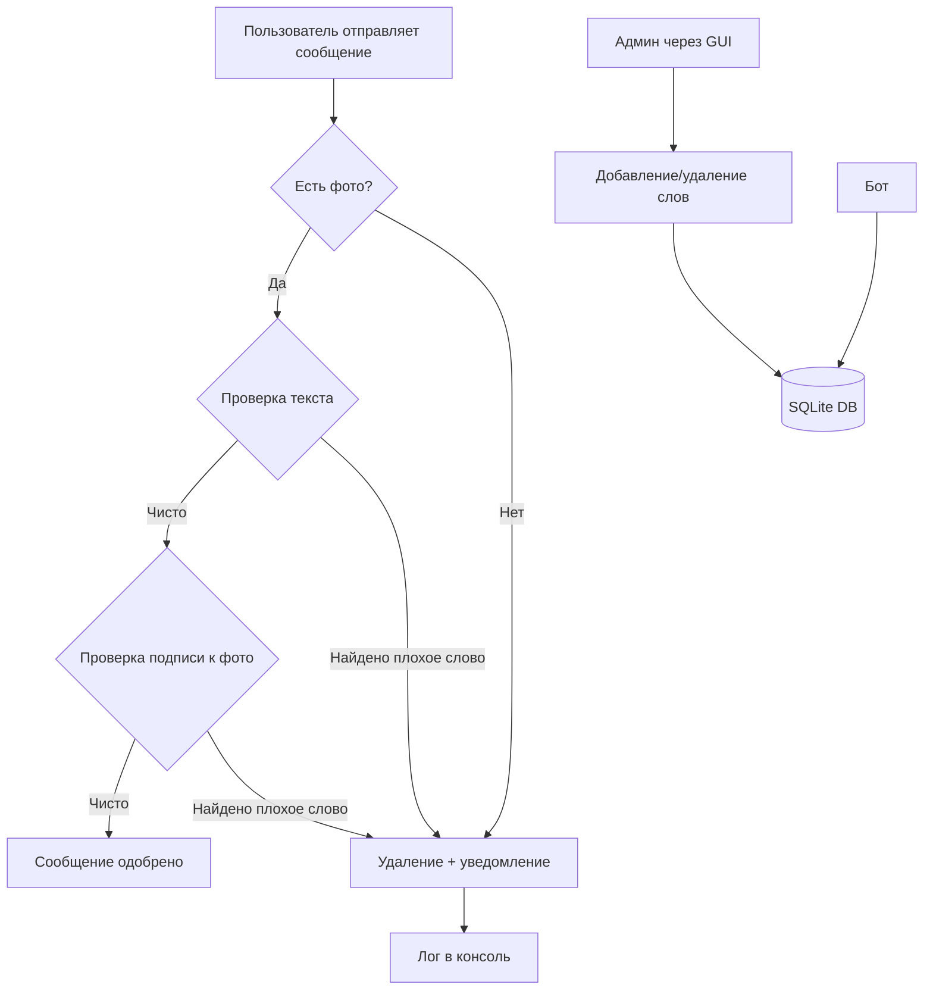

# 🛡️ FleaMarket Blacklist Bot + GUI

**Профессиональный инструмент для модерации Telegram-барахолок.**  
Сочетает асинхронную мощь `aiogram 3` и современный интерфейс на `CustomTkinter`.


---

## 📋 Оглавление
- [О проекте](#-о-проекте)
- [Основные возможности](#-основные-возможности)
- [Архитектура и принципы работы](#-архитектура-и-принципы-работы)
- [Технологии](#-технологии)
- [Установка и запуск](#-установка-и-запуск)
- [Конфигурация](#-конфигурация)
- [Документация](#-документация)
  - [Команды бота](#команды-бота-для-админов)
  - [API эндпоинты](#api-эндпоинты)
  - [Структура базы данных](#структура-базы-данных)
- [Принцип работы модерации](#-принцип-работы-модерации)
- [Структура проекта](#-структура-проекта)
- [Безопасность](#-безопасность)
- [Возможные проблемы и решения](#-возможные-проблемы-и-решения)
- [Лицензия](#-лицензия)

---

## 🎯 О проекте

**FleaMarket Blacklist Bot** — это комплексное решение для автоматической модерации Telegram-групп, специализирующихся на продаже товаров и услуг (барахолок, флип-маркетов, досок объявлений).

Проект решает ключевые проблемы:
- ❌ **Пустые объявления** без фотографий товара
- ❌ **Спам и запрещенные слова** в тексте объявлений
- ❌ **Нарушение правил** в подписях к фотографиям
- ❌ **Отсутствие обратной связи** с пользователями

---

## 🌟 Основные возможности

### 🤖 Бот-модератор
| Функция | Описание |
| :--- | :--- |
| **📸 Фото-фильтр** | Автоматически удаляет сообщения без фото (защита от «пустых» объявлений) |
| **🚫 Анти-флуд** | Проверка текста и подписей к фото по черному списку слов |
| **📩 Обратная связь** | Бот вежливо пишет пользователю в ЛС причину удаления его сообщения |
| **👑 Админ-панель** | Управление списком администраторов и рассылка объявлений через `/tell` |
| **📊 Логирование** | Все действия модерации записываются в консоль с цветовым выделением |

### 🖥️ Графический интерфейс (GUI)
| Функция | Описание |
| :--- | :--- |
| **Управление ЧС** | Визуальный список всех запрещенных слов с причинами блокировки |
| **Мгновенное обновление** | Добавление/удаление слов из базы данных в реальном времени |
| **Мультипоточность** | GUI и бот работают одновременно без блокировки друг друга |
| **Статус-бар** | Отображение текущего состояния бота (онлайн/оффлайн) |

---

## 🏗️ Архитектура и принципы работы

### 🏗️ Принципы работы



### 🏗️ Принципы работы

### 1. Асинхронная обработка сообщений
Бот построен на асинхронной архитектуре `aiogram 3.x`, что позволяет:
- Обрабатывать несколько сообщений одновременно
- Не блокировать поток при работе с базой данных
- Мгновенно реагировать на команды администраторов

### 2. Двухуровневая проверка

### 3. Механизм черного списка
- Хранение в SQLite с полями: `word` (слово) и `reason` (причина блокировки)
- Регистронезависимая проверка (приведение к нижнему регистру)
- Частичное совпадение (поиск подстроки)

### 4. Мультипоточность GUI
- Бот запускается в отдельном потоке
- Интерфейс остается отзывчивым
- Общая база данных доступна из обоих потоков

### 5. Система администраторов
- Администраторы хранятся в таблице `admins`
- Команды доступны только пользователям из этой таблицы
- Возможность динамического добавления/удаления админов

---

## 🛠 Технологии

| Компонент | Технология | Версия | Назначение |
| :--- | :--- | :--- | :--- |
| **Бот** | Aiogram | 3.x | Асинхронный фреймворк для Telegram Bot API |
| **GUI** | CustomTkinter | 5.x | Современная тема для Tkinter |
| **БД** | SQLite3 | 3 | Встроенная легковесная база данных |
| **Переменные** | python-dotenv | 1.x | Управление переменными окружения |
| **Логирование** | Colorama | 0.4.x | Цветной вывод в консоль |

---

## 📥 Установка и запуск

### Требования
- Python 3.10 или выше
- Telegram Bot Token (получить у [@BotFather](https://t.me/BotFather))

### Пошаговая инструкция

#### 1. Клонирование репозитория
```bash
git clone https://github.com/LightKeeper417/FleaMarket.git
cd FleaMarket
```

#### 2. Установка зависимостей
```bash
pip install aiogram customtkinter python-dotenv colorama
```

#### 3. Запуск приложения
```bash
python gui_app.py
```

#### 4. Первоначальная настройка
1. В открывшемся GUI-окне нажмите **"Запустить бота"**
2. Перейдите в консоль (терминал)
3. Введите токен бота при запросе
4. Токен автоматически сохранится в файл `.env`

#### 5. Добавление бота в группу
1. Добавьте бота в вашу Telegram-группу
2. Сделайте бота администратором группы
3. Выполните команду `/id_group` в группе
4. Убедитесь, что ID группы появился в консоли

---

## ⚙️ Конфигурация

### Файл `.env` (создается автоматически)
```env
BOT_TOKEN=ваш_токен_бота_здесь
```

### Настройка в коде (main.py)
```python
# ID группы, куда бот будет отвечать (заполняется автоматически)
GROUP_ID = None  # Определяется при первом сообщении

# Сообщение при удалении
WARNING_MESSAGE = "⚠️ Ваше сообщение было удалено. Причина: {reason}"
```

---

## 📚 Документация

### Команды бота (для админов)

| Команда | Синтаксис | Описание | Пример |
| :--- | :--- | :--- | :--- |
| `/start` | `/start` | Приветствие и публикация правил в группе | `/start` |
| `/tell` | `/tell [текст]` | Отправить сообщение в группу от имени бота | `/tell Внимание, новые правила!` |
| `/add_blacklist` | `/add_blacklist` | Интерактивное добавление слова в ЧС (бот задаст вопросы) | `/add_blacklist` |
| `/Check` | `/Check` | Проверка статуса работы бота | `/Check` |
| `/id_group` | `/id_group` | Вывод ID текущего чата в консоль (только для отладки) | `/id_group` |

### API эндпоинты (внутренние)

#### База данных

**Черный список (таблица `blacklist`)**
```python
# Добавление слова
add_blacklist_word(word: str, reason: str) -> None

# Удаление слова
remove_blacklist_word(word: str) -> bool

# Получение всех слов
get_all_blacklist() -> List[Tuple[str, str]]

# Проверка текста
contains_bad_word(text: str) -> Tuple[bool, str]
```

**Администраторы (таблица `admins`)**
```python
# Добавление админа
add_admin(user_id: int) -> None

# Удаление админа
remove_admin(user_id: int) -> bool

# Проверка админа
is_admin(user_id: int) -> bool
```

### Структура базы данных

```sql
-- Таблица черного списка
CREATE TABLE IF NOT EXISTS blacklist (
    id INTEGER PRIMARY KEY AUTOINCREMENT,
    word TEXT NOT NULL UNIQUE,
    reason TEXT NOT NULL
);

-- Таблица администраторов
CREATE TABLE IF NOT EXISTS admins (
    id INTEGER PRIMARY KEY AUTOINCREMENT,
    user_id INTEGER NOT NULL UNIQUE
);
```

---

## 🔍 Принцип работы модерации

### Алгоритм проверки сообщения

```python
# Псевдокод алгоритма модерации
async def moderate_message(message):
    # Шаг 1: Проверка на наличие фото
    if not message.photo:
        await delete_message(message)
        await notify_user("В объявлении должно быть фото")
        return False
    
    # Шаг 2: Проверка текста сообщения
    text_to_check = message.caption or message.text
    
    if contains_bad_word(text_to_check):
        bad_word, reason = get_forbidden_word(text_to_check)
        await delete_message(message)
        await notify_user(f"Запрещенное слово: {bad_word}\nПричина: {reason}")
        return False
    
    # Шаг 3: Если все проверки пройдены
    return True
```

### Время реакции
- Среднее время обработки сообщения: **0.5-2 секунды**
- Максимальная задержка из-за асинхронности: не более **5 секунд**

---

## 📂 Структура проекта

```
FleaMarket/
│
├── gui_app.py              # Главный файл. Запускай для работы с интерфейсом
│   ├── BlacklistApp        # Класс GUI приложения
│   ├── start_bot_thread()  # Запуск бота в отдельном потоке
│   └── update_listbox()    # Обновление списка ЧС в реальном времени
│
├── main.py                 # Ядро бота и логика модерации
│   ├── bot                 # Экземпляр бота aiogram
│   ├── dp                  # Диспетчер обработчиков
│   ├── check_message()     # Основная функция модерации
│   └── handlers            # Обработчики команд и сообщений
│
├── database.py             # Инициализация и работа с БД
│   ├── init_db()           # Создание таблиц
│   └── CRUD операции       # Работа с blacklist и admins
│
├── blacklist.db            # Ваша локальная база данных (создается автоматически)
├── .env                    # Конфиденциальный файл с токеном
└── README.md               # Этот файл
```

---

## 🔐 Безопасность

**ВАЖНО:** Файлы `.env` и `blacklist.db` добавлены в `.gitignore`.

### Рекомендации по безопасности
- ❌ **Никогда** не передавайте файл `.env` третьим лицам
- ❌ **Никогда** не коммитьте `.env` в публичные репозитории
- ✅ Регулярно меняйте токен бота через @BotFather
- ✅ Используйте разных ботов для разных групп
- ✅ Делайте резервные копии `blacklist.db`

### Что содержится в защищенных файлах
```env
# .env - содержит секретный ключ доступа к вашему боту!
BOT_TOKEN=1234567890:ABCdefGHIjklmNOPqrstUVwxyz

# blacklist.db - содержит все правила модерации
```

---

## 🐛 Возможные проблемы и решения

### Проблема: Бот не удаляет сообщения
**Решение:** 
- Проверьте, что бот является администратором группы
- Убедитесь, что у бота есть права на удаление сообщений
- Проверьте консоль на наличие ошибок

### Проблема: GUI не открывается
**Решение:**
```bash
# Убедитесь, что установлены все зависимости
pip install customtkinter
# На macOS может потребоваться
brew install python-tk
```

### Проблема: Бот не отвечает на команды
**Решение:**
- Перезапустите бота кнопкой "Стоп" → "Старт" в GUI
- Проверьте, правильно ли введен токен в `.env`
- Убедитесь, что интернет-соединение стабильно

### Проблема: "Group ID не найден"
**Решение:**
- Отправьте любое сообщение в группу с ботом
- Выполните команду `/id_group` в группе
- ID отобразится в консоли

---

## 📄 Лицензия

Проект распространяется под лицензией **MIT**.  
Вы можете свободно использовать, модифицировать и распространять код с указанием авторства.
